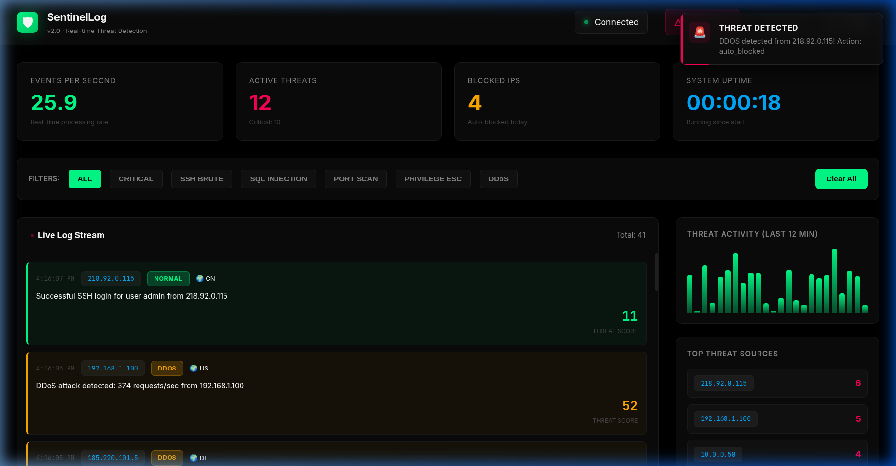
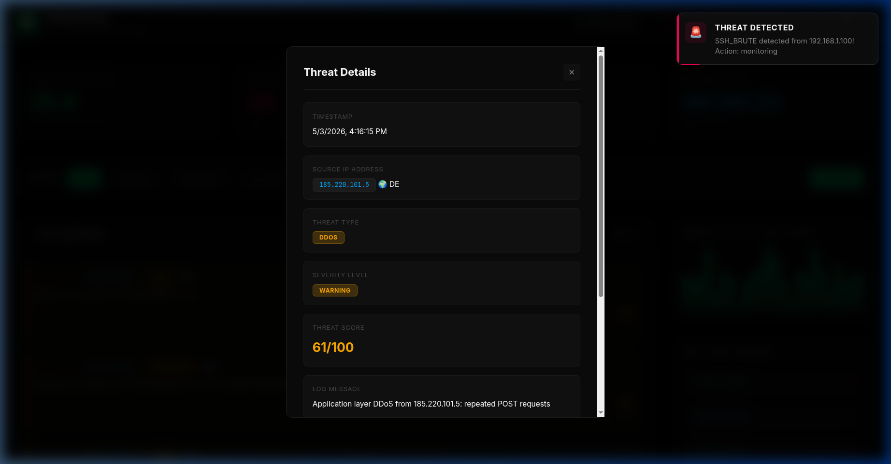
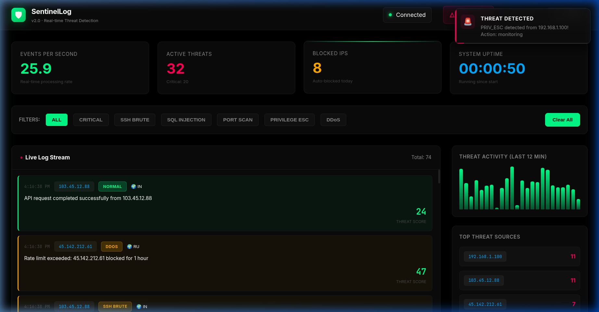

# 🛡️ SentinelLog v2.0
### Real-Time Threat Detection & Cyber-Security Monitoring System

[](https://fastapi.tiangolo.com/)
[](https://www.python.org/)
[](https://developer.mozilla.org/en-US/docs/Web/JavaScript)
[](LICENSE)

SentinelLog is a professional-grade, real-time security operations center (SOC) dashboard designed to detect, visualize, and mitigate network threats in milliseconds. Built with a high-performance **FastAPI** backend and a reactive **Vanilla JS** frontend, it provides an elite monitoring experience with low-latency log streaming via WebSockets.

---

## ⚡ Key Features

- 🕵️ **Intelligent Threat Detection**: Real-time analysis for SSH Brute-force, SQL Injection, Port Scanning, Privilege Escalation, and DDoS attacks.
- 📡 **Reactive WebSocket Stream**: Instant log delivery with automatic reconnection logic.
- 📊 **Advanced Analytics**: Visual distribution of attack types and 12-minute activity heatmaps.
- 🚫 **Automated Mitigation**: Intelligent auto-blocking system for IPs exceeding the threat threshold (85+ score).
- 🎨 **Premium UI/UX**: Cyberpunk-inspired dark interface with glassmorphism effects and smooth micro-animations.
- 📑 **Data Export**: Export live log data to standard JSON formats for further forensic analysis.

---

## 📸 Dashboard Preview


*Figure 1: Real-time dashboard demonstration showing log streaming, modal analysis, and premium notifications.*


*Figure 2: Full-scale monitoring console with live metrics.*

<p align="center">
  
  
</p>
*Figure 2 & 3: Deep-dive threat analysis modal and premium alert system.*

---

## 🛠️ Technology Stack

| Component | Technology | Use Case |
| :--- | :--- | :--- |
| **Backend** | FastAPI (Python) | High-concurrency API & Logic |
| **Real-time** | WebSockets | Low-latency bi-directional streaming |
| **Frontend** | Vanilla JS / CSS3 | Modern UI without framework overhead |
| **Detection** | Pattern Matching | Heuristic threat identification |
| **Analytics** | Map-Reduce | Real-time statistical aggregation |

---

## 🚀 Quick Start

### 1. Clone & Setup
```bash
git clone https://github.com/builtbysardor/sentinellog-real-time-threat-detection.git
cd sentinellog-real-time-threat-detection
```

### 2. Install Dependencies
```bash
python3 -m venv venv
source venv/bin/activate  # Linux/Mac
# or: venv\Scripts\activate (Windows)

pip install -r requirements.txt
```

### 3. Launch the System
```bash
python3 main.py
```
Open your browser at `http://localhost:8000`.

---

## 📡 API Reference

### Real-time Log Stream
- `WS /ws/logs` - Bi-directional real-time communication.

### REST Endpoints
| Method | Endpoint | Description |
| :--- | :--- | :--- |
| `GET` | `/api/logs` | Fetch the most recent 200 security events. |
| `GET` | `/api/stats` | Retrieve global system telemetry. |
| `POST` | `/api/block/{ip}` | Manually blacklist a specific source IP. |
| `GET` | `/api/blocked` | List all currently blacklisted entities. |

---

## 🛡️ Security Logic

The system uses a weighted scoring mechanism:
- **0-30**: Normal Traffic (Informational)
- **40-70**: Suspicious Activity (Warning)
- **80-100**: High-Confidence Attack (Critical)

*Auto-blocking is triggered automatically at a score of 85+ for non-whitelisted IPs.*

---

## 🤝 Contributing

Contributions are what make the open source community such an amazing place to learn, inspire, and create. Any contributions you make are **greatly appreciated**.

1. Fork the Project
2. Create your Feature Branch (`git checkout -b feature/AmazingFeature`)
3. Commit your Changes (`git commit -m 'Add some AmazingFeature'`)
4. Push to the Branch (`git push origin feature/AmazingFeature`)
5. Open a Pull Request

---

## 📝 License

Distributed under the MIT License. See `LICENSE` for more information.

Developed by **[builtbysardor](https://github.com/builtbysardor)** - Built for the future of network security.
